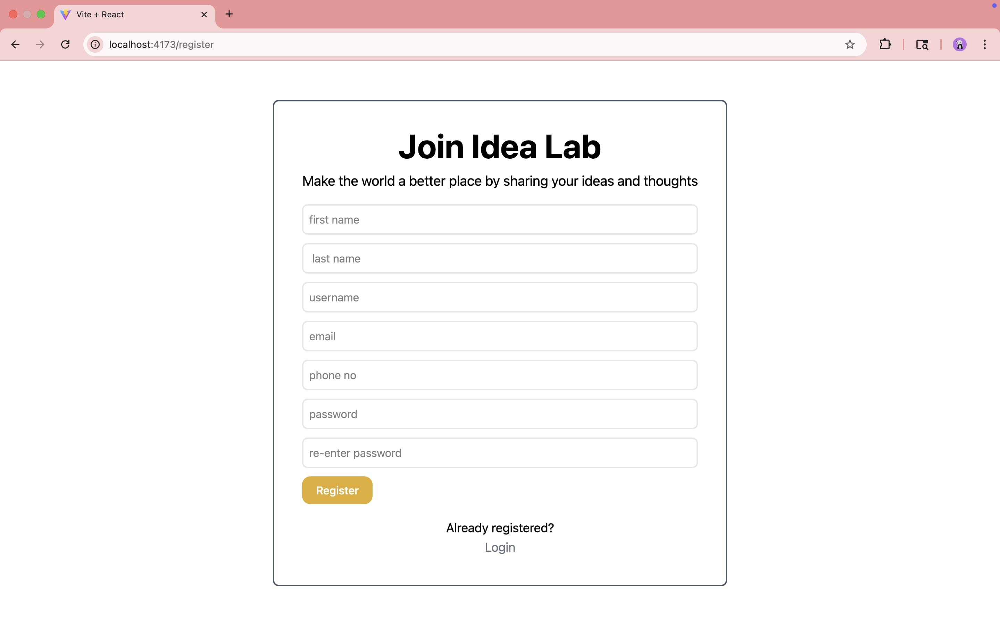
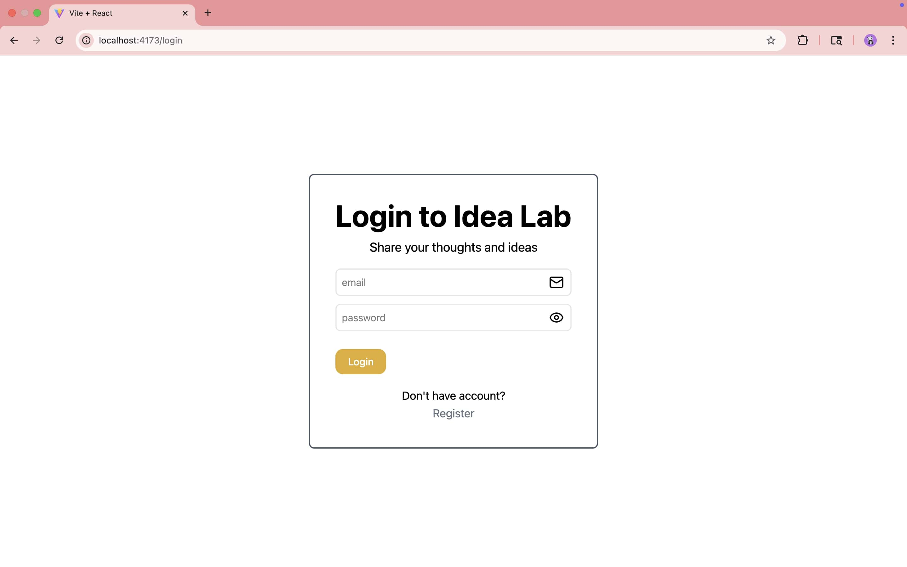
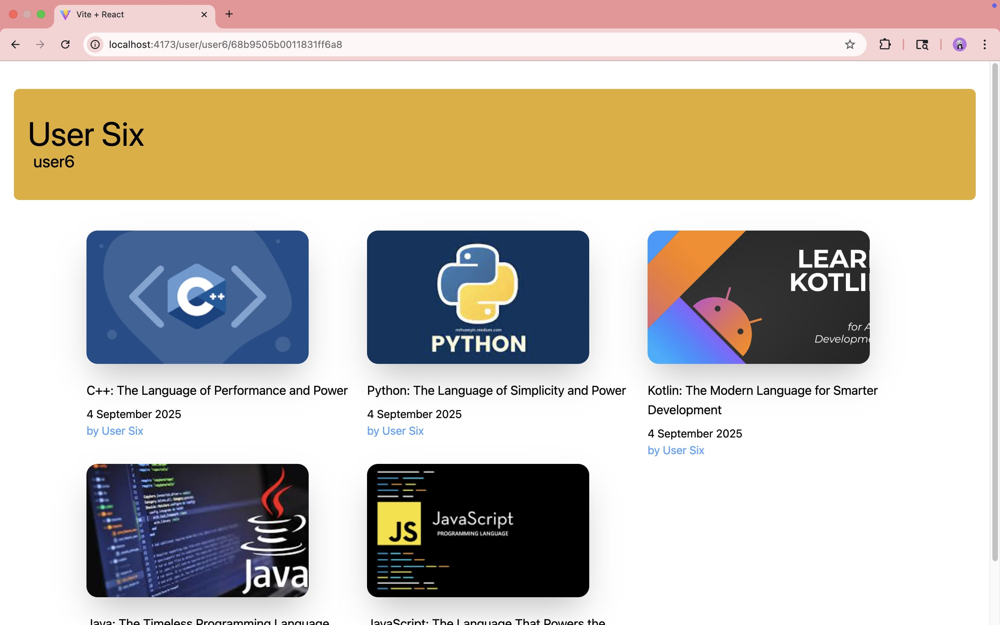
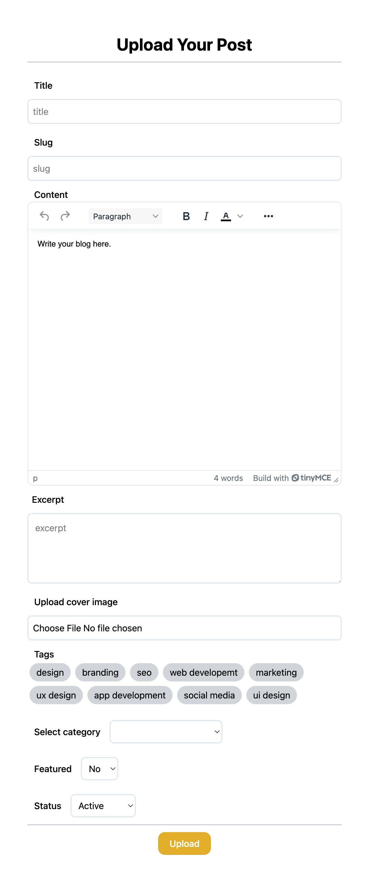
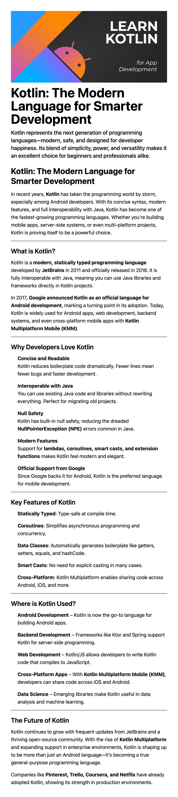

# ✉️ IDEA LAB - Built with React + Appwrite

## 📖 Description

IDEA LAB is a full-stack blog-sharing web app built using **React** (frontend) and **Appwrite** (backend). It is a complete CRUD application where users can create, edit, and share blogs. For styling, **Tailwind CSS** has been used.

## ✨ Features

- 🔐 Secure authentication system
- 👤 Personalized user profiles
- 📝 Create, edit, and delete blog posts
- 📖 Read blogs shared by others
- 🎨 Responsive UI with Tailwind CSS

## 🛠️ Built With

- React.js
- Tailwind CSS
- Appwrite

## 📸 Screenshots

### Home page


### Signup page



### Login page



### User Profile page



### Add Post page



### Read Post page



### Edit Post page


### Footer


## 🎥 [Video Demo](https://youtu.be/TkKQ0K8PDYY)

[](https://youtu.be/TkKQ0K8PDYY)

## 🚀 Getting Started

1. Clone the repository:

```bash
git clone https://github.com/saumyarex/idea-lab.git
cd idea-lab
```

2. Install dependencies:

```bash
npm install
# or
yarn install
```

3. Run the development server:

```bash
npm run dev
```

Open http://localhost:5173 with your browser to see the result.

## 📚 Learnings

While building this project, I learned the importance of using a state management library like Redux for handling complex application states. I also realized the value of writing optimized and maintainable code. This project has helped me improve my ability to structure applications better and write cleaner, more efficient code.

## 🙋‍♂️ Author

- Saumya Nayak – [@saumyarex](https://github.com/saumyarex)
